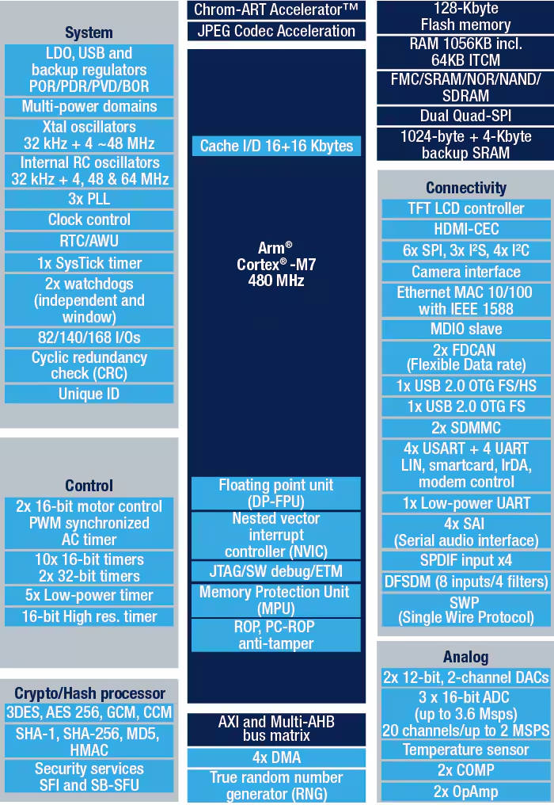

# 基本介绍

Sakura Pi Elara 1 是一款搭载 Arm® Cortex-M7 的 MCU 以及 高云 GW2A-LV18 FPGA 的异构开发板，  
搭配开源的 Elarion 交互式终端，可以轻松运行 MicroPython 及开源自制程序。  

亦可通过低门槛的 STM32 CubeIDE/CubeMX 开发套件满足快速的在线 FPGA 开发、IP 验证、测试 等需求。

:::info 对于 /* First Access */ 的小提示
**PCB 版本 1.0** 为 `First Access` 版本，在首批生产后我们发现它存在一些硬件问题
- AXP221s 电源管理不启动的问题，已用飞线修复
- CH334P 封装错误问题，出厂已加贴片转接板修复
- FPGA 侧缺少 nRST 信号 和 clk, IP 核的 nRST 需要手动在 top.v 内提供 软 BOR 用来复位， 另外需要调用片内时钟发生器(OSC)的原语连接 rPLL 硬核输出 clk 给 IP 核
- 不支持 FMC 的 async wait 功能
:::

## 特征

Sakura Pi Elara 1 的基本参数如下
- MCU: STM32H750XBH6 (Arm® Cortex-M7)
- FPGA: 高云 GW2A-LV18 PG256C
- USB: 板载 CYUSB3014支持 USB 3.0，带协议控制器
- 电源管理: AXP221s
- 网络: RTL8201F 10Mbps/100Mbps PHY
- GPIO(STM32侧): 兼容树莓派 RPi 5(UART/SPI&QSPI/UART/I2C) 及扩展(SPI/I2S/SPDIF/DAC/SWDIO)
- GPIO(FPGA侧): IO Bank 2/3/6/7 其中 6/7 支持电压调节和外部 Vref
- LCD: RGB888 接口

板载 JTAG、差分ADC、HDMI 输出以及 2 个控制按钮、
支持 Micro SD 卡

## 处理器
板载的 STM32H750XBH6 具有最高频率 480 MHz 的 Cortex-M7 MCU 和 MPU，
以及高达 1 MB 的片上 SRAM，支持缓存技术(L1 I-Cache / D-Cache)，带有硬件双精度浮点处理器。

你可以在 [此页面](https://www.st.com/en/microcontrollers-microprocessors/stm32h750xb.html) 获取更多相关资讯。

## 可编程门阵列 (FPGA)

高云 GW2A-LV18 FPGA 具有 20K LUT，40K SSRAM 以及 828K BSRAM。

作为 Elara 开发板家族的主要特色，Sakura Pi Elara 1 搭载了 高云 GW2A-LV18 FPGA，可通过 STM32 灵活加载比特流文件，
也可以通过板载的 JTAG 调试器使用 USB 在线编程。原生支持高云云源 IDE，充分发挥异构的灵活优势。

### FPGA 到 STM32
:::info fmcapb3 仓库地址
https://github.com/Sakura-Pi/fmcapb3
:::
FPGA 与 STM32 通过 FMC 总线进行驳接, 其 FMC 总线具备高达 32 Bit 的数据访存宽度以及 26 Bit 的地址寻址能力，得益于 fmcapb3 的开源桥接 IP，可以轻松实现 STM32 和 标准 IP 核的无缝移植。

此外， IO BANK 6 以及 IO BANK7 的电压可由 PMIC 动态调节，支持外部 Vref。

### FPGA 到 CYUSB3014

你也可以将 CYUSB3014 当作 FPGA 的 USB 3.0 PHY 使用，这样可以绕开 FMC 转而使用更高速的传输介面。

## 引脚定义

:::info
本图片是可缩放矢量图形(SVG), 可在 <a target="\_blank" href='/dl/product/sakurapi-elara-1/img/board-pinout.svg'>新标签页内打开大图</a>
:::

## 基准测试
:::info
待补充基准测试数据
:::