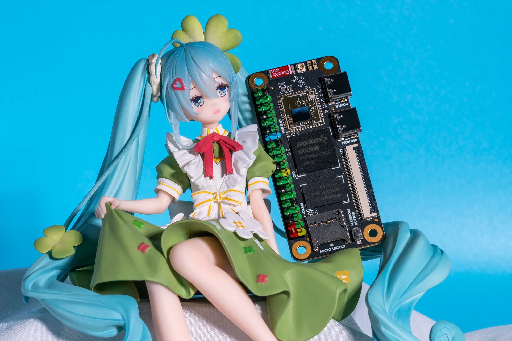

# 基本介绍

Sakura Pi RK3308B 是我们首款正式发售的SBC。

它是一款搭载 Rockchip RK3308B SoC 的低功耗、低成本开发板。



### 处理器

得益于 ARM® Cortex A35 处理器，使 RK3308B 具有 低功耗、低成本、低热量 等诸多优点。
在现代移动设备的处理器架构中，Cortex A35 因其高效能时而扮演 `小核(能效核/E核)`的角色，使系统在应对复杂任务与长时间待机间达到较好的平衡。


### 特征
Sakura Pi RK3308B 的基本配置参数如下
- 处理器: RK3308B
- 内存: DDR3 512M 
- 无线WLAN: 支持IEEE 802.11a/b/g/n/ac,支持2.4GHz/5GHz频段
- 蓝牙: 支持BLE4.2
- EMMC: 0/8/16G 容量可选
- 指示灯: WS2812(SPI) * 4
- LCD: RGB666接口

TODO:主板各个元器件的分布图介绍

### 引脚定义

Sakura Pi RK3308B 具备与 Raspberry Pi Zero W 兼容的 40 Pin 引脚。

u-boot 和 kernel 默认使用 UART2 作为输出端口


### 基准测试

#### UnixBench

|CPU主频|单核跑分|多核跑分|
|--|--|--|
|1.0Ghz|172.2|563.4|
|1.3Ghz|210.3|671.9|

<details>
  <summary>1.0Ghz UnixBench</summary>
  ```
  ========================================================================
   BYTE UNIX Benchmarks (Version 5.1.3)

   System: sakurapi-rk3308b: GNU/Linux
   OS: GNU/Linux -- 6.12.23-current-rockchip64 -- #2 SMP PREEMPT Thu Apr 10 20:39:41 HKT 2025
   Machine: aarch64 (unknown)
   Language: en_US.utf8 (charmap="UTF-8", collate="UTF-8")
   CPU 0: ARM Cortex-A35 (48.0 bogomips)
          CPU Features: fp asimd evtstrm aes pmull sha1 sha2 crc32 cpuid
   CPU 1: ARM Cortex-A35 (48.0 bogomips)
          CPU Features: fp asimd evtstrm aes pmull sha1 sha2 crc32 cpuid
   CPU 2: ARM Cortex-A35 (48.0 bogomips)
          CPU Features: fp asimd evtstrm aes pmull sha1 sha2 crc32 cpuid
   CPU 3: ARM Cortex-A35 (48.0 bogomips)
          CPU Features: fp asimd evtstrm aes pmull sha1 sha2 crc32 cpuid
   19:08:56 up 56 min,  1 user,  load average: 0.73, 0.73, 0.42; runlevel 2025-04-11

------------------------------------------------------------------------
Benchmark Run: Fri Apr 11 2025 19:08:56 - 19:37:02
4 CPUs in system; running 1 parallel copy of tests

Dhrystone 2 using register variables        4390531.8 lps   (10.0 s, 7 samples)
Double-Precision Whetstone                     1204.4 MWIPS (10.0 s, 7 samples)
Execl Throughput                                288.4 lps   (29.9 s, 2 samples)
File Copy 1024 bufsize 2000 maxblocks         93939.0 KBps  (30.0 s, 2 samples)
File Copy 256 bufsize 500 maxblocks           27259.1 KBps  (30.0 s, 2 samples)
File Copy 4096 bufsize 8000 maxblocks        244850.1 KBps  (30.0 s, 2 samples)
Pipe Throughput                              221670.8 lps   (10.0 s, 7 samples)
Pipe-based Context Switching                  17347.5 lps   (10.0 s, 7 samples)
Process Creation                                543.1 lps   (30.0 s, 2 samples)
Shell Scripts (1 concurrent)                    952.2 lpm   (60.0 s, 2 samples)
Shell Scripts (8 concurrent)                    290.6 lpm   (60.1 s, 2 samples)
System Call Overhead                         307830.4 lps   (10.0 s, 7 samples)

System Benchmarks Index Values               BASELINE       RESULT    INDEX
Dhrystone 2 using register variables         116700.0    4390531.8    376.2
Double-Precision Whetstone                       55.0       1204.4    219.0
Execl Throughput                                 43.0        288.4     67.1
File Copy 1024 bufsize 2000 maxblocks          3960.0      93939.0    237.2
File Copy 256 bufsize 500 maxblocks            1655.0      27259.1    164.7
File Copy 4096 bufsize 8000 maxblocks          5800.0     244850.1    422.2
Pipe Throughput                               12440.0     221670.8    178.2
Pipe-based Context Switching                   4000.0      17347.5     43.4
Process Creation                                126.0        543.1     43.1
Shell Scripts (1 concurrent)                     42.4        952.2    224.6
Shell Scripts (8 concurrent)                      6.0        290.6    484.4
System Call Overhead                          15000.0     307830.4    205.2
                                                                   ========
System Benchmarks Index Score                                         172.2

------------------------------------------------------------------------
Benchmark Run: Fri Apr 11 2025 19:37:02 - 20:05:16
4 CPUs in system; running 4 parallel copies of tests

Dhrystone 2 using register variables       17375717.0 lps   (10.0 s, 7 samples)
Double-Precision Whetstone                     4755.7 MWIPS (10.0 s, 7 samples)
Execl Throughput                                893.7 lps   (30.0 s, 2 samples)
File Copy 1024 bufsize 2000 maxblocks        350019.2 KBps  (30.0 s, 2 samples)
File Copy 256 bufsize 500 maxblocks          106703.9 KBps  (30.0 s, 2 samples)
File Copy 4096 bufsize 8000 maxblocks        610322.2 KBps  (30.0 s, 2 samples)
Pipe Throughput                              877759.9 lps   (10.0 s, 7 samples)
Pipe-based Context Switching                 113403.0 lps   (10.0 s, 7 samples)
Process Creation                               1898.4 lps   (30.0 s, 2 samples)
Shell Scripts (1 concurrent)                   2244.3 lpm   (60.1 s, 2 samples)
Shell Scripts (8 concurrent)                    296.1 lpm   (60.6 s, 2 samples)
System Call Overhead                        1215141.6 lps   (10.0 s, 7 samples)

System Benchmarks Index Values               BASELINE       RESULT    INDEX
Dhrystone 2 using register variables         116700.0   17375717.0   1488.9
Double-Precision Whetstone                       55.0       4755.7    864.7
Execl Throughput                                 43.0        893.7    207.8
File Copy 1024 bufsize 2000 maxblocks          3960.0     350019.2    883.9
File Copy 256 bufsize 500 maxblocks            1655.0     106703.9    644.7
File Copy 4096 bufsize 8000 maxblocks          5800.0     610322.2   1052.3
Pipe Throughput                               12440.0     877759.9    705.6
Pipe-based Context Switching                   4000.0     113403.0    283.5
Process Creation                                126.0       1898.4    150.7
Shell Scripts (1 concurrent)                     42.4       2244.3    529.3
Shell Scripts (8 concurrent)                      6.0        296.1    493.4
System Call Overhead                          15000.0    1215141.6    810.1
                                                                   ========
System Benchmarks Index Score                                         563.4
```
</details>

<details>
  <summary>1.3Ghz UnixBench</summary>
  ```
========================================================================
   BYTE UNIX Benchmarks (Version 5.1.3)

   System: sakurapi-rk3308b: GNU/Linux
   OS: GNU/Linux -- 6.12.23-current-rockchip64 -- #2 SMP PREEMPT Thu Apr 10 20:39:41 HKT 2025
   Machine: aarch64 (unknown)
   Language: en_US.utf8 (charmap="UTF-8", collate="UTF-8")
   CPU 0: ARM Cortex-A35 (48.0 bogomips)
          CPU Features: fp asimd evtstrm aes pmull sha1 sha2 crc32 cpuid
   CPU 1: ARM Cortex-A35 (48.0 bogomips)
          CPU Features: fp asimd evtstrm aes pmull sha1 sha2 crc32 cpuid
   CPU 2: ARM Cortex-A35 (48.0 bogomips)
          CPU Features: fp asimd evtstrm aes pmull sha1 sha2 crc32 cpuid
   CPU 3: ARM Cortex-A35 (48.0 bogomips)
          CPU Features: fp asimd evtstrm aes pmull sha1 sha2 crc32 cpuid
   05:51:01 up 3 min,  1 user,  load average: 0.36, 0.21, 0.10; runlevel 2025-04-12

------------------------------------------------------------------------
Benchmark Run: Sat Apr 12 2025 05:51:01 - 06:19:05
4 CPUs in system; running 1 parallel copy of tests

Dhrystone 2 using register variables        5640815.9 lps   (10.0 s, 7 samples)
Double-Precision Whetstone                     1548.9 MWIPS (10.1 s, 7 samples)
Execl Throughput                                333.2 lps   (29.9 s, 2 samples)
File Copy 1024 bufsize 2000 maxblocks        116631.1 KBps  (30.0 s, 2 samples)
File Copy 256 bufsize 500 maxblocks           34717.5 KBps  (30.0 s, 2 samples)
File Copy 4096 bufsize 8000 maxblocks        283747.8 KBps  (30.0 s, 2 samples)
Pipe Throughput                              286177.6 lps   (10.0 s, 7 samples)
Pipe-based Context Switching                  22383.8 lps   (10.0 s, 7 samples)
Process Creation                                612.4 lps   (30.0 s, 2 samples)
Shell Scripts (1 concurrent)                   1111.3 lpm   (60.0 s, 2 samples)
Shell Scripts (8 concurrent)                    325.8 lpm   (60.1 s, 2 samples)
System Call Overhead                         395002.8 lps   (10.0 s, 7 samples)

System Benchmarks Index Values               BASELINE       RESULT    INDEX
Dhrystone 2 using register variables         116700.0    5640815.9    483.4
Double-Precision Whetstone                       55.0       1548.9    281.6
Execl Throughput                                 43.0        333.2     77.5
File Copy 1024 bufsize 2000 maxblocks          3960.0     116631.1    294.5
File Copy 256 bufsize 500 maxblocks            1655.0      34717.5    209.8
File Copy 4096 bufsize 8000 maxblocks          5800.0     283747.8    489.2
Pipe Throughput                               12440.0     286177.6    230.0
Pipe-based Context Switching                   4000.0      22383.8     56.0
Process Creation                                126.0        612.4     48.6
Shell Scripts (1 concurrent)                     42.4       1111.3    262.1
Shell Scripts (8 concurrent)                      6.0        325.8    543.1
System Call Overhead                          15000.0     395002.8    263.3
                                                                   ========
System Benchmarks Index Score                                         210.3

------------------------------------------------------------------------
Benchmark Run: Sat Apr 12 2025 06:19:05 - 06:47:14
4 CPUs in system; running 4 parallel copies of tests

Dhrystone 2 using register variables       22403396.8 lps   (10.0 s, 7 samples)
Double-Precision Whetstone                     6128.9 MWIPS (10.1 s, 7 samples)
Execl Throughput                                977.2 lps   (29.9 s, 2 samples)
File Copy 1024 bufsize 2000 maxblocks        419419.9 KBps  (30.0 s, 2 samples)
File Copy 256 bufsize 500 maxblocks          136432.9 KBps  (30.0 s, 2 samples)
File Copy 4096 bufsize 8000 maxblocks        638890.6 KBps  (30.0 s, 2 samples)
Pipe Throughput                             1134168.3 lps   (10.0 s, 7 samples)
Pipe-based Context Switching                 145101.5 lps   (10.0 s, 7 samples)
Process Creation                               2031.2 lps   (30.0 s, 2 samples)
Shell Scripts (1 concurrent)                   2503.7 lpm   (60.1 s, 2 samples)
Shell Scripts (8 concurrent)                    330.8 lpm   (60.5 s, 2 samples)
System Call Overhead                        1565701.4 lps   (10.0 s, 7 samples)

System Benchmarks Index Values               BASELINE       RESULT    INDEX
Dhrystone 2 using register variables         116700.0   22403396.8   1919.7
Double-Precision Whetstone                       55.0       6128.9   1114.3
Execl Throughput                                 43.0        977.2    227.3
File Copy 1024 bufsize 2000 maxblocks          3960.0     419419.9   1059.1
File Copy 256 bufsize 500 maxblocks            1655.0     136432.9    824.4
File Copy 4096 bufsize 8000 maxblocks          5800.0     638890.6   1101.5
Pipe Throughput                               12440.0    1134168.3    911.7
Pipe-based Context Switching                   4000.0     145101.5    362.8
Process Creation                                126.0       2031.2    161.2
Shell Scripts (1 concurrent)                     42.4       2503.7    590.5
Shell Scripts (8 concurrent)                      6.0        330.8    551.3
System Call Overhead                          15000.0    1565701.4   1043.8
                                                                   ========
System Benchmarks Index Score                                         671.9
  ```
</details>

### 引用
- [1] AP6255 datasheet_V1.2_06202016.pdf
<a href="./res/AP6255 datasheet_V1.2_06202016.pdf">aa</a>

