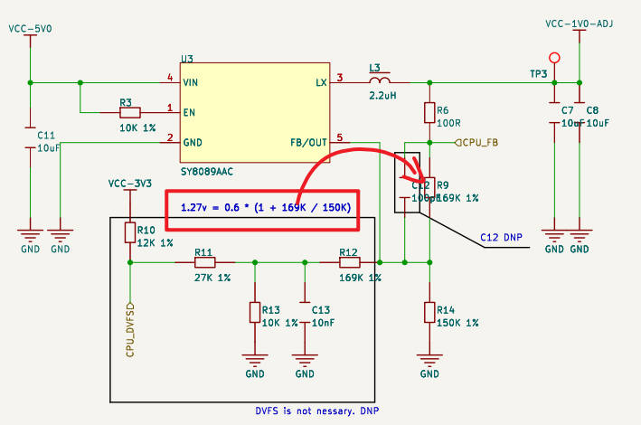
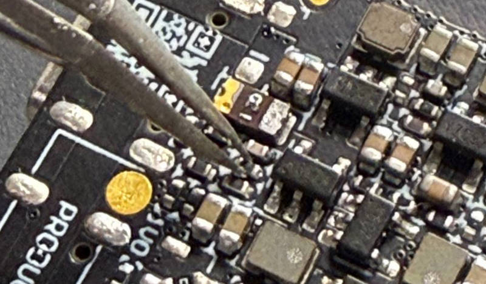
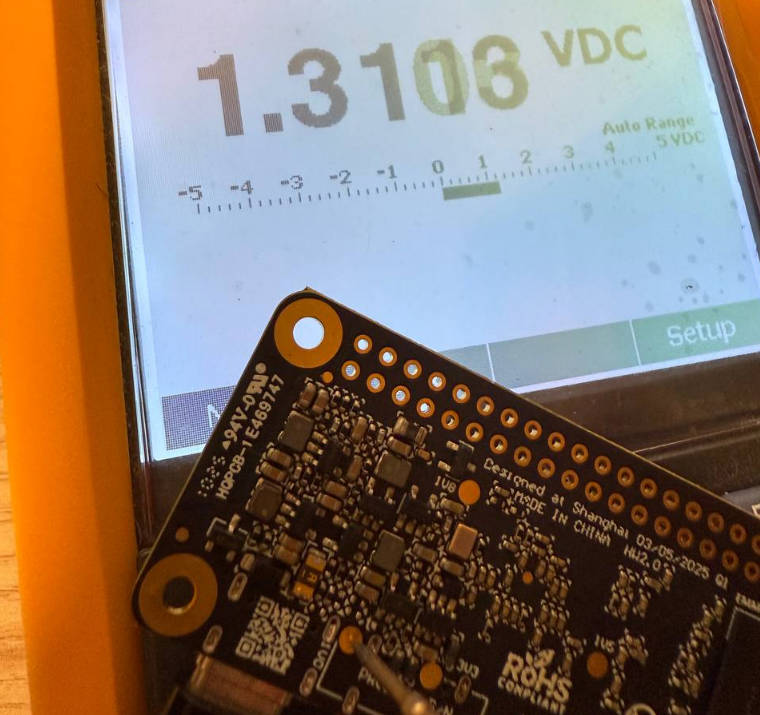

:::info 难度等级 ★★★★★
:::

:::tip 章节提示
本章节将指导你如何硬改 CPU 电压配合 dtbo 进行超频
:::

<!-- truncate -->

## 引言

### 术语查找表
| 术语 | 对应解释 |
| -- | -- |
| dtb  | Device Tree Binary |
| dtbo | DTB Overlay |

### 摘要
RK3308B 的默认频率只有 1.0GHz 左右。但是根据手册，RK3008B 的频率能达到 1.3GHz，能不能超频呢？
答案是当然可以的！ 但是因为 Sakura Pi RK3308B 的 CPU 电压默认是 1.0V，如果想解锁全部性能则需要硬改加压。

我们在[极限测试](../introduce.md#llvmpipe-glsl)中，也是使用了此方法进行超频的。
~~只要不超过结温 140 度，随便干~~

:::warning
超频后 RK3308B 无论是功耗还是温度都会显著增加，建议配合散热片使用
:::

## 硬改电压

### 参考电路
参考 Sakura Pi RK3308B 的原理图，找到负责 CPU 主供电的降压电路。



:::info
Sakura Pi RK3308B 原理图设计时是 R9 是 169K，但实际生产时部分批次是 100K。  
如果你测量 TP3 的电压约 1.27V 则可以跳过此步骤。
:::

根据公式计算
- 0.6 * (1 + 100 / 150) = 0.99
- 0.6 * (1 + 169 / 150) = 1.27

可以将 R9 电阻从 100K 1% 换成 169K 1%，这样电压会从 1.0V 提升到 1.276V。

### 拆换电阻

:::warning
硬改是一个胆大心细的过程，如果你执意要做，那么就动起你的小手不要畏惧它  
但尽管如此，这么做引起的硬件损坏我们不予任何的保修，硬改有风险请知悉
:::



如图所示这颗电阻即为 R9 电阻，拆下并更换。

### 测量电压和验证



## 配置超频 dtbo

为了确保 overlay_prefix 的一致性, 复制一份新文件
```
$ cp /boot/dtb/rockchip/overlay/rk3308-bs@1.3ghz.dtbo /boot/dtb/rockchip/overlay/rockchip-rk3308-bs@1.3ghz.dtbo
```

然后在 `/boot/armbianEnv.txt` 的 overlays 行加入 `rk3308-bs@1.3ghz` 即可。  
如果没有 overlays 行则在末尾自己加一个。

重启，并检查 u-boot 的输出正确 (类似请参考 [配置-dtbo](./ws2812-leds.md#配置-dtbo))
