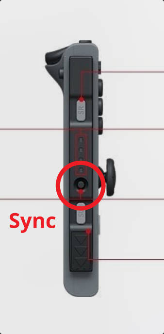
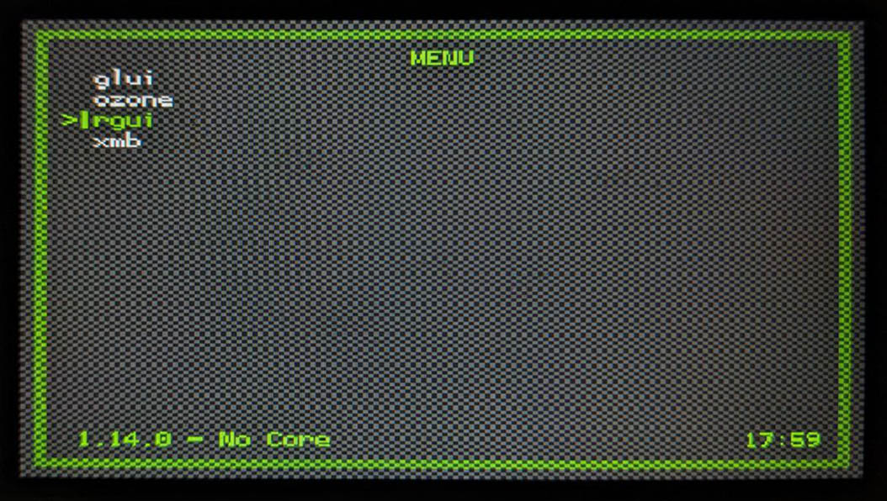
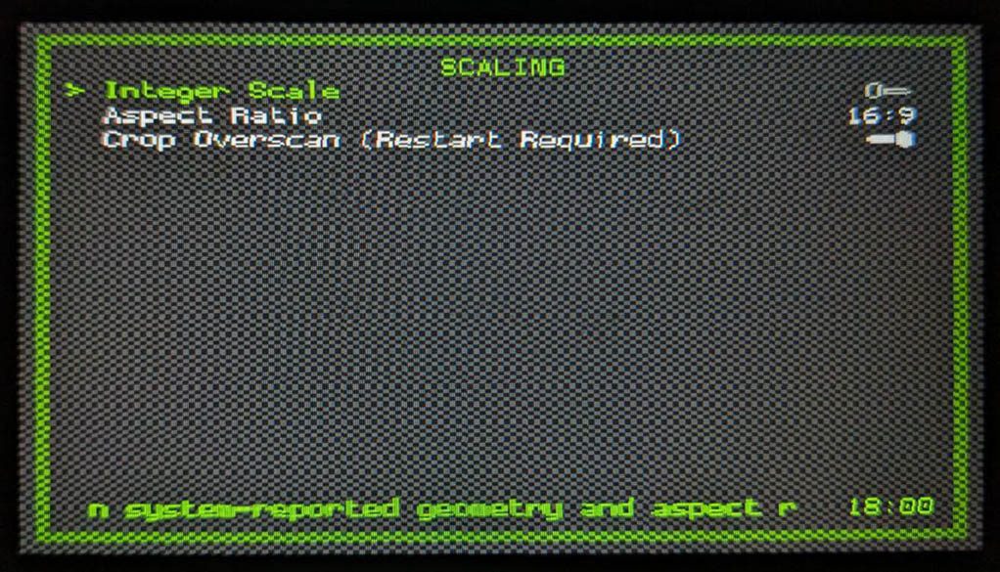
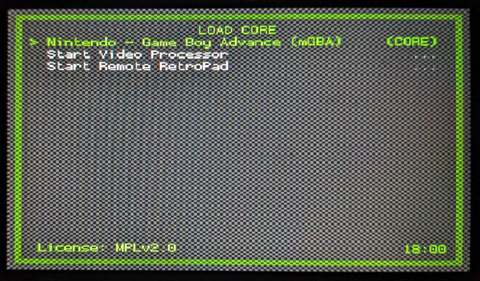
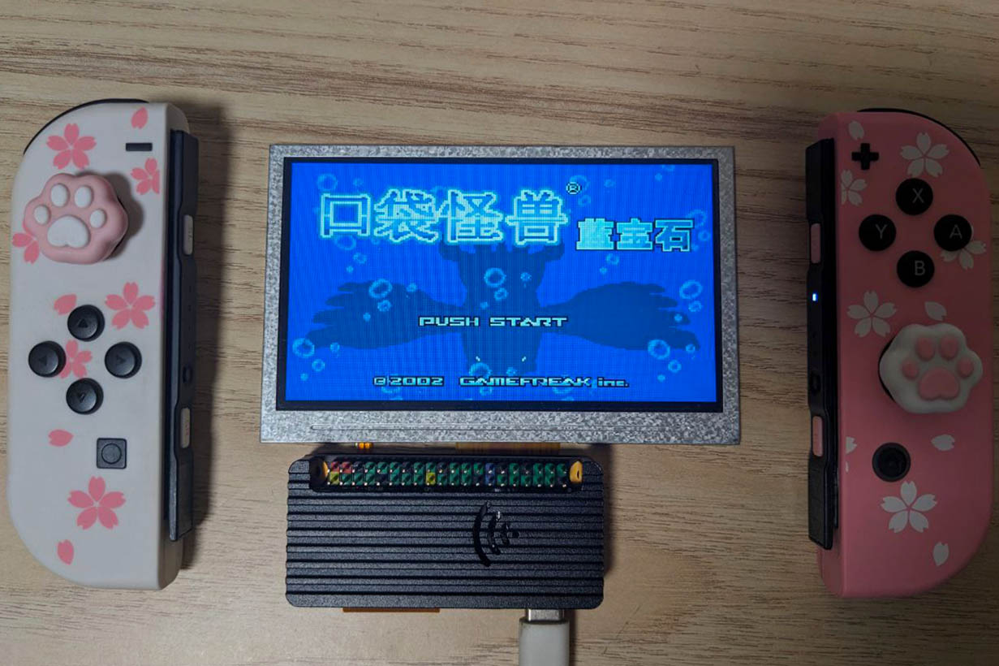

:::info 难度等级 ★☆☆☆☆
:::

:::tip 章节提示
本文讲述了如何通过命令行连接蓝牙外设
:::

<!-- truncate -->

## 引言

### 术语引用表
暂无

### 摘要
我们可以利用 Sakura Pi RK3308B 的板载 AP6255 连接鼠标、键盘等蓝牙外设，当然也可以连接上你心爱的 Nintendo Switch 的 JoyCon 把它当作一个小游戏机~

## 与 JoyCon 配对

### 安装软件包
使用以下命令安装 bluetooth 软件包。
```bash
sudo apt install bluetooth
```
### 使用 bluetoothctl 查找设备
输入命令 `bluetoothctl` 进入终端，并输入 `scan on`打开扫描模式。
```bash
root@sakurapi-rk3308b:~# bluetoothctl
Agent registered
[CHG] Controller AA:AA:AA:AA:AA:AA Pairable: yes
[bluetooth]# scan on
Discovery started
[NEW] Device FF:FF:FF:FF:FF:FF xxx
[NEW] Device 8C:D0:B2:7C:B4:2F giot.plug.v6shsm
[NEW] Device 78:13:B8:A8:94:E6 78-13-B8-A8-94-E6
```

此时，找到 JoyCon 的 SYNC 键并按住，直到控制器的灯光开始闪烁时松手。  


观察终端，应该会出现如下设备。

```bash
[NEW] Device AA:BB:CC:DD:EE:FF JoyCon (L)
[NEW] Device 11:22:33:44:55:66 JoyCon (R)
```

### 配对并连接

在上面的例子中，我们从终端获取了 JoyCon 的 MAC 地址
- AA:BB:CC:DD:EE:FF
- 11:22:33:44:55:66

举例，我们连接 JoyCon (L)，则键入命令 `pair AA:BB:CC:DD:EE:FF`
```bash
[bluetooth]# pair AA:BB:CC:DD:EE:FF
Attempting to pair with AA:BB:CC:DD:EE:FF
[CHG] Device AA:BB:CC:DD:EE:FF Connected: yes
[CHG] Device AA:BB:CC:DD:EE:FF Bonded: yes
[CHG] Device AA:BB:CC:DD:EE:FF Modalias: usb:v057Ep2006d0001
[CHG] Device AA:BB:CC:DD:EE:FF UUIDs: 00001000-0000-1000-8000-00805f9b34fb
[CHG] Device AA:BB:CC:DD:EE:FF UUIDs: 00001124-0000-1000-8000-00805f9b34fb
[CHG] Device AA:BB:CC:DD:EE:FF UUIDs: 00001200-0000-1000-8000-00805f9b34fb
[CHG] Device AA:BB:CC:DD:EE:FF ServicesResolved: yes
[CHG] Device AA:BB:CC:DD:EE:FF Paired: yes
Pairing successful
[CHG] Device AA:BB:CC:DD:EE:FF WakeAllowed: yes
[CHG] Device 7C:C2:94:C4:36:B3 RSSI: -90
[CHG] Device AA:BB:CC:DD:EE:FF ServicesResolved: no
[CHG] Device AA:BB:CC:DD:EE:FF Connected: no
```

等待 Pairing successful，然后立刻 `connect AA:BB:CC:DD:EE:FF`
```bash
[Joy-Con (L)]# connect AA:BB:CC:DD:EE:FF
Attempting to connect to AA:BB:CC:DD:EE:FF
Connection successful
```
看到 Connection successful 提示，并且看到 JoyCon 的玩家灯光开始随机闪烁，说明连接成功。遵循以上步骤再连接另一个手柄之后，同时按住两个手柄的 ZL 和 ZR 键，等待 Linux 系统自动分配玩家 id。等待灯固定到 Player 1 之后，就可以使用了。

## 玩点游戏
连上手柄之后，难道不想玩一点游戏吗~ 我们来试试开个 Pokémon 怎么样!  
~阿伟你又在打电动哦.mp3~

### 安装 RetroArch
键入以下指令安装 RetroArch
```bash
sudo apt install retroarch
```
然后运行 `retroarch` 启动游戏。

### 一些性能优化

转到 `Settings > Drivers > Menu` 设置成 rgui。使用简单的界面可以关闭不必要的特效，提升帧率。


转到 `Settings > Video > Scaling` 按图中设置。


使用临近采样可以降低性能开销。

### 加载 mgba 核心


然后就可以开游戏辣！

