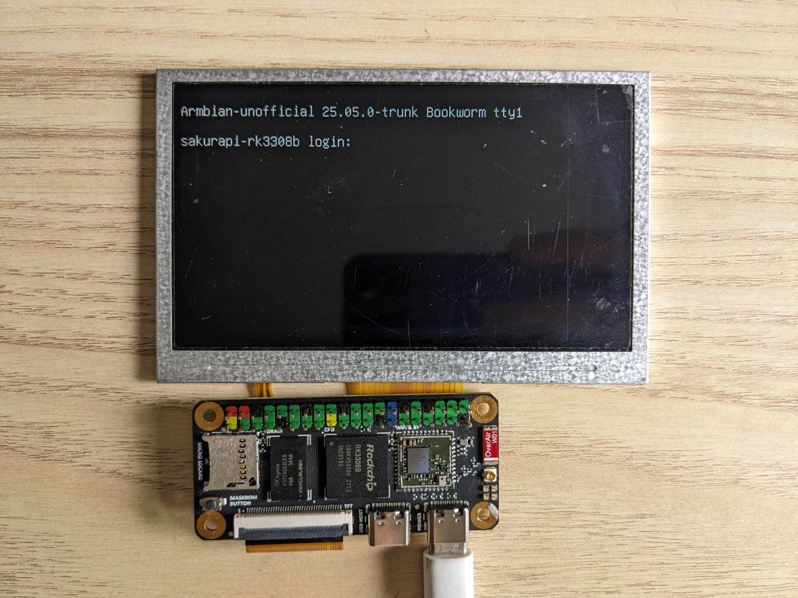

:::info 难度等级 ★☆☆☆☆
:::

:::tip 章节提示
本文讲述了如何连接 40Pin RGB 显示屏，并向 fb 设备刷新图像并显示到屏幕上
:::

<!-- truncate -->

## 引言

###  术语引用表
| 术语 | 对应解释 |
| -- | -- |
| fb  | Frame Buffer |
| DPI | Display Parallel Interface
| VOP | Video Output Processor |
| dtb | Device Tree Binary |
| dtbo | DTB Overlay |

1. VOP 是 Rockchip 的视频输出模块，负责简单平面叠加、填充、光标、Alpha Blend 等基础 2D 图形功能。

### 摘要
在我们的圈子里面一直流传着一句金句: ~~有屏的地方就有坏苹果~~  
年轻人不想来点个屏看看？

## 选择屏幕型号
Sakura Pi RK3308B 有一个 40Pin 的标准 DPI 接口。  
目前我们测试过能用的屏如下表所示，你可以根据自己需要自由选择。由于屏幕多种多样并不能全部收录，所以仅供参考。 一般来说，IPS 面板的屏幕比 TFT 的显示效果更好。

:::warning
由于体积的限制，板上的背光驱动能力有限，导致无法驱动较大尺寸或较高背光功耗的屏幕。
必要情况下(如遇到画面闪烁、不亮等)，请使用外置的背光供电板或更换屏幕。
:::

| 型号 | 尺寸 | 大约价格 |
| -- | -- | -- |
| GL043056B0-40 | 4.3"@480x272 | 22CNY ~ 45CNY |
| RFH043X4024-01(EP4307) | 4.3"@480X272 | 20CNY |
| RFH043BIVI40A027-V2(EP4306) | 4.3"@480X272 | 25CNY |
| KD50G6-40TM-A1 | 5.0"@800x480 | 50CNY |
| MD050NL42-40-12A | 5.0"@800x480 | 60CNY |

## 上电开机

按照图中屏幕的接法连接屏幕，插入电源开机。默认情况下屏幕会自动被点亮。


## 屏幕的识别与分辨率调整

Sakura Pi RK3308B的设备树默认的分辨率为800x480，但即使是分辨率不匹配，部分屏幕依旧可以工作，例如"RFH043BIVI40A027-V2(EP4306)"，可以显示480x272区域的图像，而更大分辨率的屏幕，部分屏幕可以显示，在800x480之外的区域，会有异常的图像显示。

### 使用 dtbo
该 dtso 位于 Armbian 的主线仓库内，默认会随着发行版自动编译成 dtbo 并放到 `/boot/dtb/rockchip/overlay` 目录下。**如果你想直接使用它，请在 `/boot/armbianEnv.txt` 
的 overlays 行加入 sakurapi-rk3308b-display@480x272 即可 (如果没有这行就添加，分辨率为自己屏幕的分辨率，如果没有支持，需自行配置dtbo)**。  

### 配置 dtbo

如果你需要自订 dtso，那么对于我们这个开发板需要写成下面这样。其中compatible是对应的屏幕型号。
<details>
  <summary>rockchip-sakurapi-rk3308b-display@480x272.dtso</summary>
```dts
/dts-v1/;
/plugin/;

/ {
    fragment@0 {
        target = <&display>;
        __overlay__ {
            compatible = "edt,etm0430g0dh6";
            status = "okay";
        };
    };
};

```
</details>
