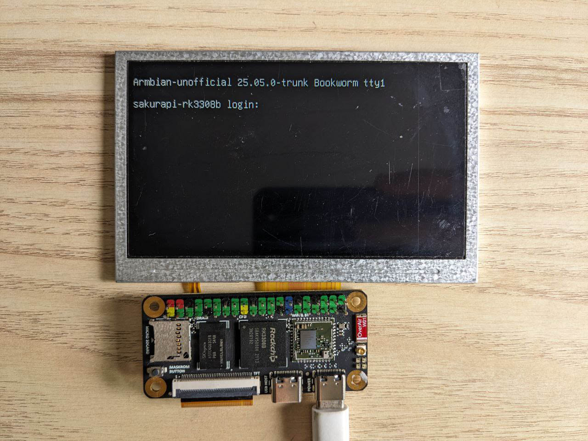

:::info 难度等级 ★☆☆☆☆
:::

:::tip 章节提示
本章节将指导你如何连接 40Pin RGB 显示屏，并向 fb 设备刷新图像并显示到屏幕上
:::

<!-- truncate -->

## 引言

###  术语引用表
| 术语 | 对应解释 |
| -- | -- |
| fb  | Frame Buffer |
| DPI | Display Parallel Interface
| VOP | Video Output Processor |
| dtb | Device Tree Binary |
| dtbo | DTB Overlay |
| dtso | DTS Overlay |

1. VOP 是 Rockchip 的视频输出模块，负责简单平面叠加、填充、光标、Alpha Blend 等基础 2D 图形功能。

### 摘要
在我们的圈子里面一直流传着一句金句: ~~有屏的地方就有坏苹果~~  
年轻人不想来点个屏看看？

## 选择屏幕型号
Sakura Pi RK3308B 有一个 40Pin 的标准 DPI 接口。  
目前我们测试过能用的屏如下表所示，你可以根据自己需要自由选择。由于屏幕多种多样并不能全部收录，所以仅供参考。 一般来说，IPS 面板的屏幕比 TFT 的显示效果更好。

:::warning
由于体积的限制，板上的背光驱动能力有限，导致无法驱动较大尺寸或较高背光功耗的屏幕。
必要情况下(如遇到画面闪烁、不亮等)，请使用外置的背光供电板或更换屏幕。
:::

| 型号 | 尺寸 | 大约价格 | 设备树文件 |
| -- | -- | -- | -- |
| GL043056B0-40 | 4.3"@480x272 | 22CNY ~ 45CNY | [rockchip-sakurapi-rk3308b-display@480x272.dtbo](../assets/dt/rockchip-sakurapi-rk3308b-display@480x272.dtbo) |
| RFH043X4024-01(EP4307) | 4.3"@480X272 | 20CNY | [rockchip-sakurapi-rk3308b-display@480x272.dtbo](../assets/dt/rockchip-sakurapi-rk3308b-display@480x272.dtbo) |
| RFH043BIVI40A027-V2(EP4306) | 4.3"@480X272 | 25CNY | [rockchip-sakurapi-rk3308b-display@480x272.dtbo](../assets/dt/rockchip-sakurapi-rk3308b-display@480x272.dtbo) |
| KD50G6-40TM-A1 | 5.0"@800x480 | 50CNY | [rockchip-sakurapi-rk3308b-display@800x480.dtbo](../assets/dt/rockchip-sakurapi-rk3308b-display@800x480.dtbo) |
| MD050NL42-40-12A | 5.0"@800x480 | 60CNY | [rockchip-sakurapi-rk3308b-display@800x480.dtbo](../assets/dt/rockchip-sakurapi-rk3308b-display@800x480.dtbo)  |

## 上电开机

按照图中屏幕的接法连接屏幕，插入电源开机。默认情况下屏幕会自动被点亮。


## 屏幕的识别与分辨率调整

Sakura Pi RK3308B的设备树默认的分辨率为800x480，但即使是分辨率不匹配，部分屏幕依旧可以工作，例如"RFH043BIVI40A027-V2(EP4306)"，可以显示480x272区域的图像，而更大分辨率的屏幕，部分屏幕可以显示，在800x480之外的区域，会有异常的图像显示。

### 使用 dtbo
该 dtso 位于 Armbian 的主线仓库内，默认会随着发行版自动编译成 dtbo 并放到 `/boot/dtb/rockchip/overlay` 目录下。或者你也可以在 [选择屏幕型号](#选择屏幕型号) 章节下载合适自己屏幕的 dtbo。

**配置使用dtbo时，请在 `/boot/armbianEnv.txt` 
的 overlays 行加入 sakurapi-rk3308b-display@480x272 即可 (如果没有这行就添加，分辨率为自己屏幕的分辨率，如果没有支持，需自行编译dtbo)**。  

### 为自己的屏幕编写 dtso

如果你需要自订 dtso，那么对于我们这个开发板需要写成下面这样。其中 compatible 是对应的屏幕型号。在内核驱动 probe 的过程中，该字段下的 `edt,etm0430g0dh6` 会被 [panel-simple.c #L1941-L1952](https://elixir.bootlin.com/linux/v6.14.6/source/drivers/gpu/drm/panel/panel-simple.c#L1941-L1952) 识别并映射到模块内已适配过的屏幕所对应的参数上。

:::tip 屏幕型号
你可以在 [panel-simple.yaml](https://github.com/torvalds/linux/blob/master/Documentation/devicetree/bindings/display/panel/panel-simple.yaml) 找到主线内核支持的所有屏幕型号，以及类似屏幕的参数参考
:::

```dts
/dts-v1/;
/plugin/;

/ {
    fragment@0 {
        target = <&display>;
        __overlay__ {
            compatible = "edt,etm0430g0dh6";
            status = "okay";
        };
    };
};
```

如果你的屏幕过于~先进~，还没有被内核支持，那么情况就更复杂一些。你需要写成下面这个样子。你可能会注意到 compatible 字段变成了 `panel-dpi`。这是因为 [panel-simple.c #L5217-L5218](https://elixir.bootlin.com/linux/v6.14.6/source/drivers/gpu/drm/panel/panel-simple.c#L5217-L5218) 有一个兜底 probe。当我们使用它的时候，我们就可以在设备树中自由编写屏幕所需要的参数，从而避免去编辑内核代码的麻烦。
而解析 panel-timing 的地方位于 [panel-simple.c #L435-L479](https://elixir.bootlin.com/linux/v6.14.6/source/drivers/gpu/drm/panel/panel-simple.c#L435-L479)。

```dts
/dts-v1/;
/plugin/;

/ {
    fragment@0 {
        target = <&display>;
        __overlay__ {
            compatible = "panel-dpi";
            status = "okay";

            panel-timing {
                clock-frequency = <25000000>; // 单位 Hz
                hactive = <800>;
                vactive = <480>;
                hfront-porch = <8>;
                hback-porch = <8>;
                hsync-len = <4>;
                vfront-porch = <16>;
                vback-porch = <16>;
                vsync-len = <4>;

                hsync-active = <0>;   // 0：低电平有效，1：高电平有效
                vsync-active = <0>;
                de-active = <1>;      // 通常是 1
                pixelclk-active = <1>; // 对应 DISPLAY_FLAGS_PIXDATA_POSEDGE
            };
        };
    };
};
```


## 向屏幕缓冲区写入数据

在shell中，可以使用以下命令向屏幕缓冲区写入随机数据
```
cat /dev/random > /dev/fb0
```
在c中，可以使用mmap映射屏幕缓冲区
<details>
  <summary>display_test.c</summary>
```
#include <fcntl.h>
#include <unistd.h>
#include <sys/mman.h>
#include <linux/fb.h>
#include <sys/ioctl.h>
#include <stdint.h>

int main() {
    int fb = open("/dev/fb0", O_RDWR);

    struct fb_var_screeninfo vinfo;
    struct fb_fix_screeninfo finfo;
    ioctl(fb, FBIOGET_VSCREENINFO, &vinfo);
    ioctl(fb, FBIOGET_FSCREENINFO, &finfo);

    int screensize = finfo.line_length * vinfo.yres;
    uint32_t *fbp = mmap(0, screensize, PROT_READ | PROT_WRITE, MAP_SHARED, fb, 0);

    for (int y = 0; y < vinfo.yres; y++) {
        for (int x = 0; x < vinfo.xres; x++) {
            int loc = y * (finfo.line_length / 4) + x;
            fbp[loc] = 0xFF0000FF;  // 红色 RGBA: R=255, G=0, B=0, A=255
        }
    }

    munmap(fbp, screensize);
    close(fb);
    return 0;
}
```
</details>

## 播放坏苹果

:::info TODO: 需要补充
:::