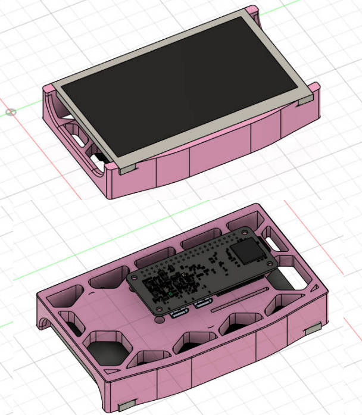
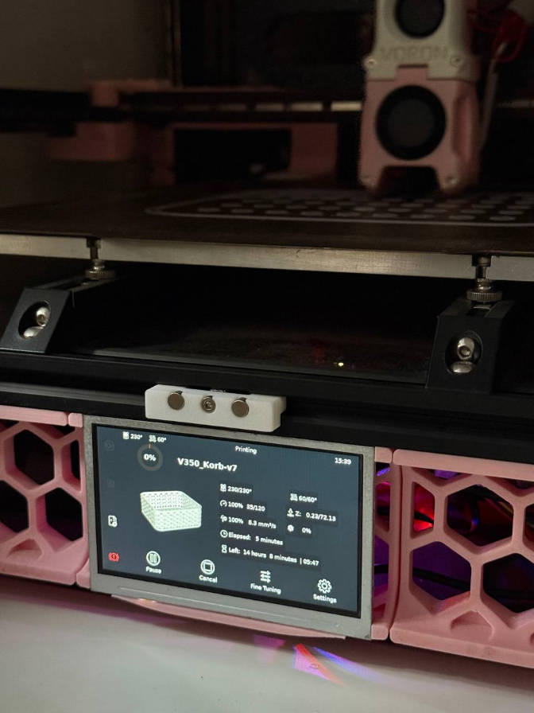

:::info 难度等级 ★★☆☆☆
:::

:::tip 章节提示
本章节将指导你如何将 Sakura Pi RK3308B 作为 Klipper 上位机使用
:::

<!-- truncate -->

## 引言

### 术语引用表
暂无

### 摘要
如此小巧还能点屏的 Linux 开发板，拿去做成 Klipper 上位机似乎也挺不错?  
如果你也有一台 Voron 2.4，那么不妨一起来试试?

## Kiauh 安装和配置
### 安装和配置
将 Sakura Pi RK3308B 刷入最新的 Armbian 镜像并启动, 连上WiFi。  
执行以下命令安装所需要的软件包
```bash
$ apt update && apt install git -y
```

接着, 克隆最新版本的 kiauh 到本地并运行
```bash
$ cd ~ && git clone https://github.com/dw-0/kiauh.git --depth 1
$ ./kiauh/kiauh.sh
```
:::info
因为配置过程已经有大量的文档, 我们不提供非常详尽的以及重复的配置教程  
你可以参考以下页面完成配置
- https://github.com/dw-0/kiauh
- https://www.klipper3d.org/zh/Installation.html
- https://zhuanlan.zhihu.com/p/689587370
- https://www.jianshu.com/p/6d45af6d8966
:::

**记得最后在 kiauh 的页面选择 KlipperScreen 安装哦~**

## 前面板安装
### STL 模型

:::info 点击下载模型 ♪~ (🌸◡‿◡)
 我们提供了 Fusion360 格式的 f3d 文件和用于打印切片用的 stl 文件  
 <a target="\_blank" href={require('./voron-klipper/FrontSkirtLogo.zip').default}>FrontSkirtLogo.zip</a>
:::

为了将 Sakura Pi RK3308B 装到 Voron 机器内部, 我们为此基于官方版本设计了一个可以安装 480*272 屏幕的前面板。
屏幕背面用双面胶固定, FPC 穿过开槽连接到位于背面的开发板。


模型上有 3 个对应开发板螺丝位的开孔, 使用 Voron 同款热熔螺母, 需要自行安装。

:::warning 注意事项
 由于安装高度问题, 建议购买两个 Type C 90度转接头, 否则可能会顶到 Voron 的配电箱底板。
:::

### 前面板组装
:::info
TODO 需要补充步骤
:::

