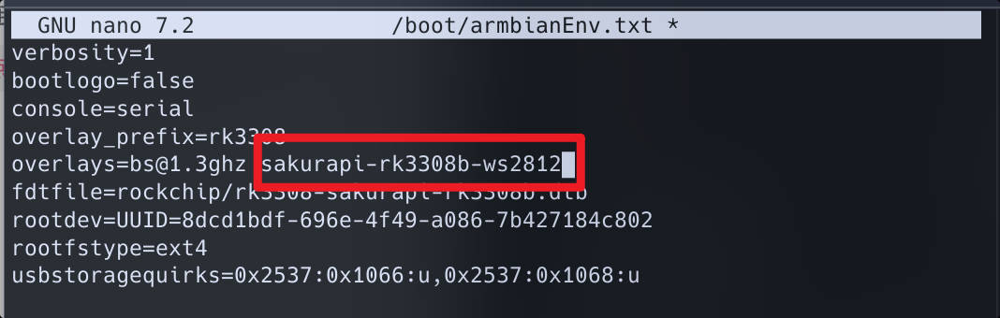
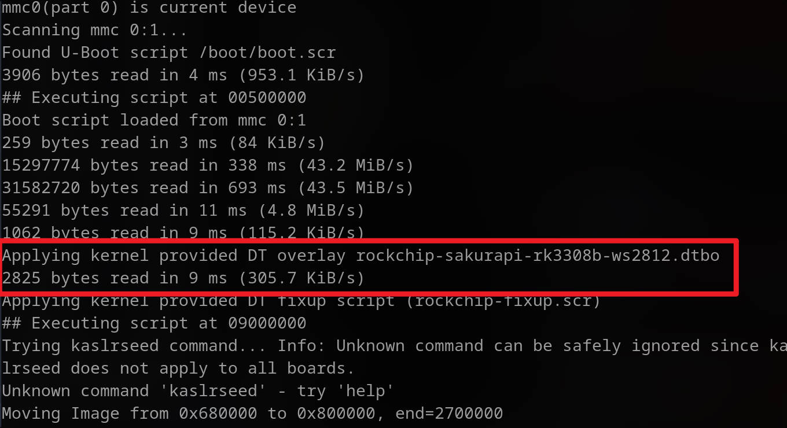
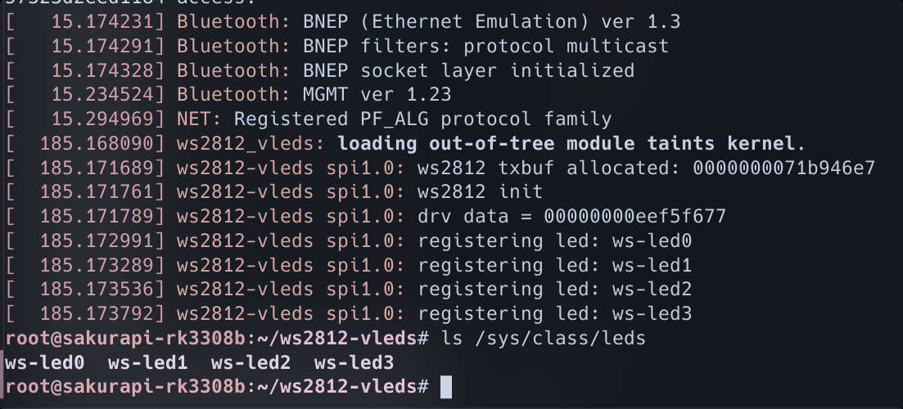

:::info 难度等级 ★★★☆☆
:::

:::tip 章节提示
本文讲述了如何使用 spidev 或我们的内核驱动点亮板载 WS2812 LED。
:::

<!-- truncate -->

## 引言

### 术语引用表
| 术语 | 对应解释 |
| -- | -- |
| spidev | SPI device |

### 摘要
Sakura Pi RK3308B 板载了 4 枚精致小巧的 WS2812 LED。它们可用于错误警告、心跳、HDD读写等的指示，甚至显示简单动画。
但是因为 WS2812 协议的特殊性，到目前为止 Linux 始终没有 WS2812 的官方内核驱动，所以需要我们手动来添加对它们的支持。

:::tip 协议特殊性
特殊性是指目前没有广泛使用的、专门用于 WS2812 的硬件或电路的 IP 核。SPI 的 MOSI 设计上是 'Master Out Slave In'，
它只要使用合适的频率就可以被滥用成可编程的波形生成器，从而可以用做各种协议的驱动时序。虽然它从设计上并不是用于 WS2812 的。
:::

我们将 WS2812 的 DIN *(Data In)* 连接到了 RK3308B 的 SPI MOSI 接口上。所以想要点亮它们只需要编写符合规范的 SPI 内核驱动，
或者在用户空间下使用 Python 对 spidev 进行输出。  

当然，你也可以用你喜欢的语言对 spidev 编程，然后点亮它们。

## WS2812 通讯协议

:::tip 如果你只想立刻点亮它，请转到 [专有内核驱动](#专有内核驱动) 章节
:::

WS2812 使用了一个十分简洁的三节拍制的串行通讯协议，


## 专有内核驱动

:::info GitHub 仓库地址
https://github.com/Sakura-Pi/ws2812-vleds
:::

我们为此写了一个内核驱动用来适配 WS2812。它使用设备树去描述颜色、位置、功能以及绑定，使得我们可以将 WS2812 当作普通 LED 一样使用，具有简单灵活的特性。
它不仅可以驱动板载的 WS2812，也可以用于驱动 WS2812 灯带或矩阵。  

但需要注意的是，这个驱动并不适合用来把 WS2812 作为屏幕。

:::warning 注意事项
这个驱动目前实现目前还不完整，部分特性还处于开发阶段，请小心使用。
:::

### 配置 dtbo

该 dtso 位于 Armbian 的主线仓库内，默认会随着发行版自动编译成 dtbo 并放到 `/boot/dtb/rockchip/overlay` 目录下。**如果你想直接使用它，请在 `/boot/armbianEnv.txt` 
的 overlays 行加入 sakurapi-rk3308b-ws2812 即可 (如果没有这行就添加)**。  



重启，并检查 u-boot 的输出


如果你需要自订 dtso，那么对于我们这个开发板需要写成下面这样。或者参阅:  
https://github.com/Sakura-Pi/build/blob/main/patch/kernel/archive/rockchip64-6.14/overlay/rockchip-sakurapi-rk3308b-ws2812.dtso

<details>
  <summary>rockchip-sakurapi-rk3308b-ws2812.dtso</summary>
```dts
/ {
	fragment@0 {
		target = <&spi1>;
		__overlay__ {

			status = "okay";

			ws2812@0 {
				compatible = "ws2812-vleds";
				reg = <0>;

				// spi 时钟速度
				spi-max-frequency = <6750000>;

				leds {

					// 用户定义
					ws_led3: vled3 {
						label = "ws-led3";
						default-state = "off";
						color-value = "#69b3f2";
					};

					// 用户定义
					ws_led2: vled2 {
						label = "ws-led2";
						default-state = "off";
						color-value = "#9376c8";
					};

					// 用户定义
					ws_led1: vled1 {
						label = "ws-led1";
						default-state = "off";
						color-value = "#b66bc3";
					};

					// 用户定义 默认功能 mmc1 读写状态
					// mmc1(emmc) r/w state
					ws_led0: vled0 {
						label = "ws-led0";
						default-state = "on";
						linux,default-trigger = "mmc1";
						color-value = "#eb698f";
					};

				};
			};
		};
	};
};

```
</details>

### 编译内核驱动
使用命令克隆整个 git 仓库
```bash
git clone https://github.com/Sakura-Pi/ws2812-vleds --depth 1
```
进入 ws2812-vleds 目录，make 编译并 insmod 之后，就可以通过命令就能看到我们的 WS2812 虚拟 LED 设备了。

```bash
$ make
make -C /lib/modules/6.12.23-current-rockchip64/build M=/root/ws2812-vleds modules
make[1]: Entering directory '/usr/src/linux-headers-6.12.23-current-rockchip64'
  CC [M]  /root/ws2812-vleds/src/main.o
In file included from /root/ws2812-vleds/src/main.c:12:
  LD [M]  /root/ws2812-vleds/ws2812-vleds.o
  MODPOST /root/ws2812-vleds/Module.symvers
  CC [M]  /root/ws2812-vleds/ws2812-vleds.mod.o
  CC [M]  /root/ws2812-vleds/.module-common.o
  LD [M]  /root/ws2812-vleds/ws2812-vleds.ko
make[1]: Leaving directory '/usr/src/linux-headers-6.12.23-current-rockchip64'

安装内核模块
$ sudo insmod ws2812-vleds.ko

# 查看设备
$ ls /sys/class/led/
```

:::warning 注意事项
如果 make 出现以下报错，说明你缺少 linux-headers 包。  
因为缺少了内核头文件，无法编译内核模块。

make -C /lib/modules/6.12.20-current-rockchip64/build M=/root/ws2812-vleds modules  
make[1]: *** /lib/modules/6.12.20-current-rockchip64/build: No such file or directory.  Stop.  
make: *** [Makefile:8: all] Error 2
:::

如果一切正常，如图所示


### 命令行测试
```bash
echo 255 > /sys/class/leds/<你的 LED 设备名>/brightness
```

## 使用 spidev 驱动

:::info TODO
待完成 python 示例
:::