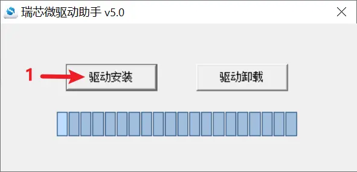
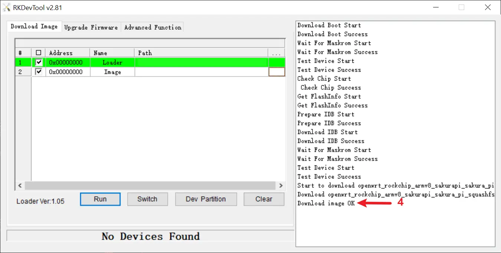

### 烧录工具
| 工具名称 | 操作系统 | 版本 | 下载地址 |
|:--|:--|:--|:--|
|DriverAssitant|Windows|v5.0|<a target="\_blank" href={require('./assets/DriverAssitant_v5.0.zip').default}>DriverAssitant_v5.0.zip</a>|
|RKDevTool|Windows|v2.81|<a target="\_blank" href={require('./assets/RKDevTool_Release_v2.81.zip').default}>RKDevTool_Release_v2.81.zip</a>|

### Loader文件
| 适用平台 | 版本 | 下载地址 |
|:--|:--|:--|
|RK3308B|20190717|<a target="\_blank" href={require('./assets/miniloader/rk3308_loader_uart0_m0_emmc_port_support_sd_20190717_old.bin.zip').default}>rk3308_loader_uart0_m0_emmc_port_support_sd_20190717_old.bin.zip</a>|

### 烧录步骤(Windows)
#### 安装驱动
1. 打开DriverAssitant软件
2. 点击图中(1)处的按钮，开始安装驱动

3. 等待弹窗提示"驱动安装完成"

#### 进入MaskROM
1. 打开RKDevTool软件
2. 在主板未上电的情况下，按住BOOT按钮的同时通过USB线缆连接PC。待听到USB连接声音，或RKDevTool软件提示找到MaskROM设备后，松开BOOT按钮。

#### 烧录镜像
1. 在图中(1)处选择Loader文件
2. 在图中(2)处选择镜像文件
4. 点击图中(3)处的按钮，开始烧录

5. 烧录完成后，RKDevTool软件会提示烧录成功，如图中(4)处所示，且状态栏提示No Devices Found
6. 拔掉USB线缆，重新上电启动设备

