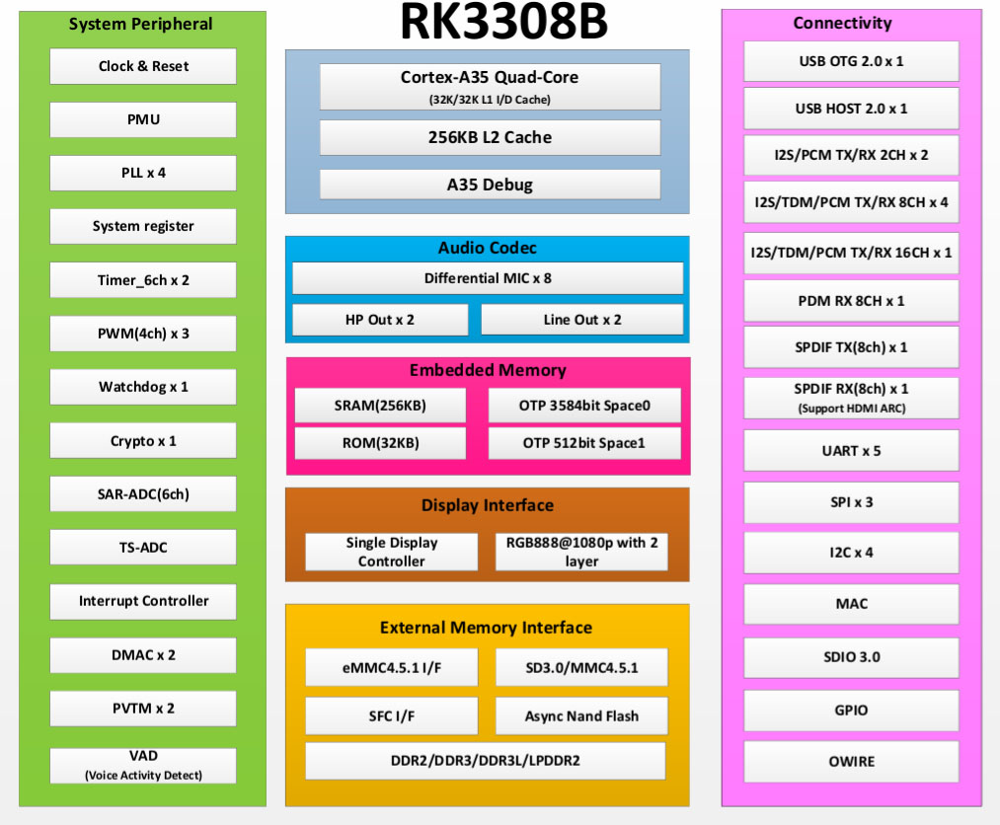

# Basic Introduction

Sakura Pi RK3308B is our first officially released SBC, a low-power, low-cost development board based on the Rockchip RK3308B SoC.

### Processor

Thanks to the ARM® Cortex A35 processor, the RK3308B has many advantages such as low power consumption, low cost, and low heat generation.
In modern mobile device processor architectures, the Cortex A35 often plays the role of a "little core" (efficiency core/E-core) due to its high efficiency, helping systems achieve a good balance between handling complex tasks and long standby times.

### Features
The basic configuration parameters of Sakura Pi RK3308B are as follows:
- Processor: RK3308B
- Memory: DDR3 512M 
- Wireless WLAN: Supports IEEE 802.11a/b/g/n/ac, supports 2.4GHz/5GHz bands
- Bluetooth: Supports BLE4.2
- EMMC: 0/8/16G capacity options
- Indicator lights: WS2812(SPI) * 4
- LCD: RGB666 interface

TODO: Introduction to the layout of various components on the board

### Benchmarks

### Pin Definition

Sakura Pi RK3308B features a 40-pin header compatible with Raspberry Pi Zero W.

### References
- [1] AP6255 datasheet_V1.2_06202016.pdf
<a href="./res/AP6255 datasheet_V1.2_06202016.pdf">aa</a>

