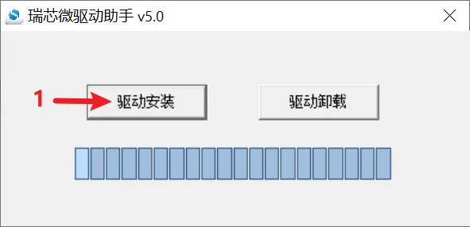
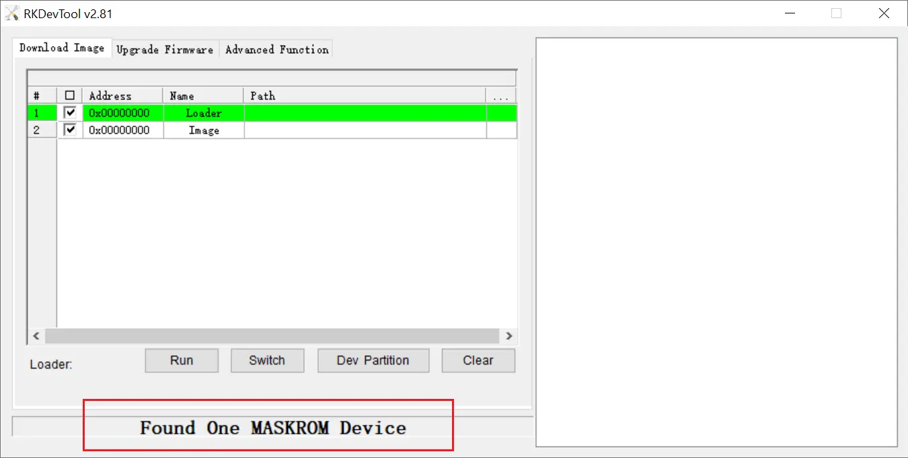
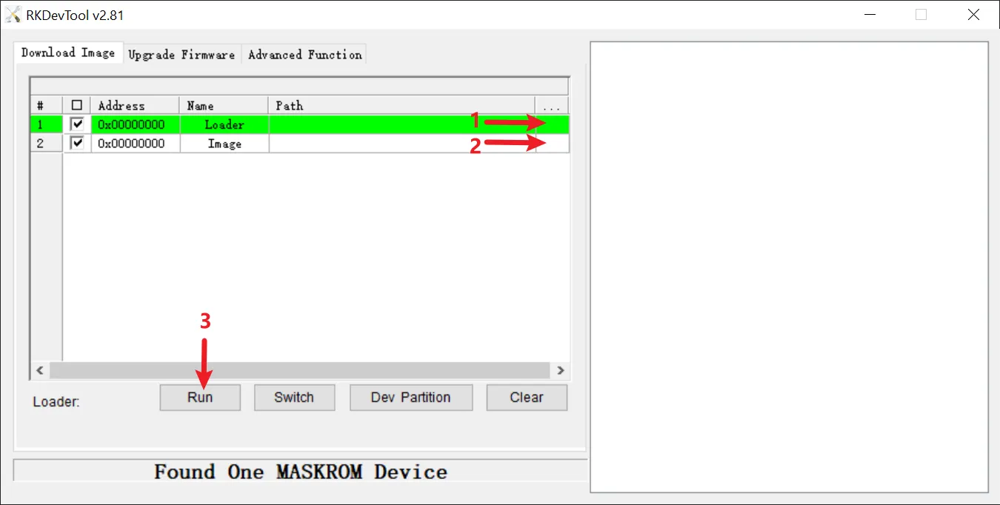
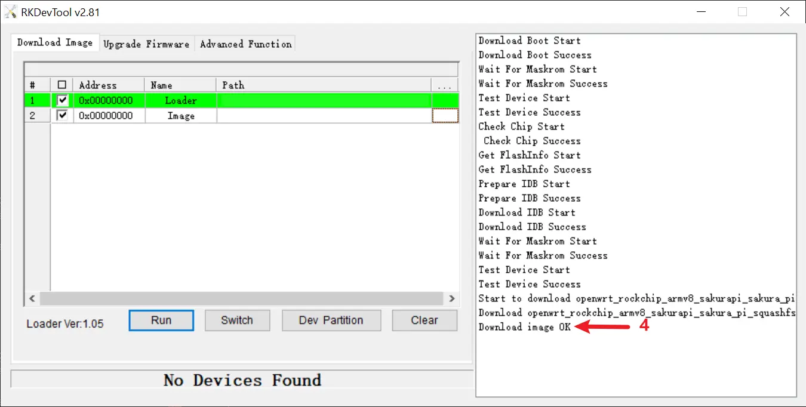

### Tools
| Name | Platform | Version | Link |
|:--|:--|:--|:--|
|DriverAssitant|Windows|v5.0|<a target="\_blank" href={require('./assets/DriverAssitant_v5.0.zip').default}>DriverAssitant_v5.0.zip</a>|
|RKDevTool|Windows|v2.81|<a target="\_blank" href={require('./assets/RKDevTool_Release_v2.81.zip').default}>RKDevTool_Release_v2.81.zip</a>|

### Mini Loader
| SoC | Version | Link |
|:--|:--|:--|
|RK3308B|20190717|<a target="\_blank" href={require('./assets/miniloader/rk3308_loader_uart0_m0_emmc_port_support_sd_20190717_old.bin.zip').default}>rk3308_loader_uart0_m0_emmc_port_support_sd_20190717_old.bin.zip</a>|

### Flash Steps (Windows)
#### Driver Install
1. Open the DriverAssistant software.
2. Click the button marked (1) in the image to begin driver installation.

3. Wait for the pop-up message indicating that the driver installation is complete.

#### Mask ROM Mode
1. Open the RKDevTool software.
2. With the board powered off, press and hold the BOOT button while connecting the board to your PC via a USB cable. Once you hear the USB connection sound or RKDevTool detects the MaskROM device, release the BOOT button.

#### 烧录镜像
1. Select the Loader file at the location marked (1) in the image.
2. Select the image file at the location marked (2).
3. Click the button marked (3) in the image to begin the flashing process.

4. Once the flashing process is complete, the RKDevTool software will display a success message at the location marked (4) in the image. The status bar will then show "No Devices Found."
5. Disconnect the USB cable and power the device on again to start it.

